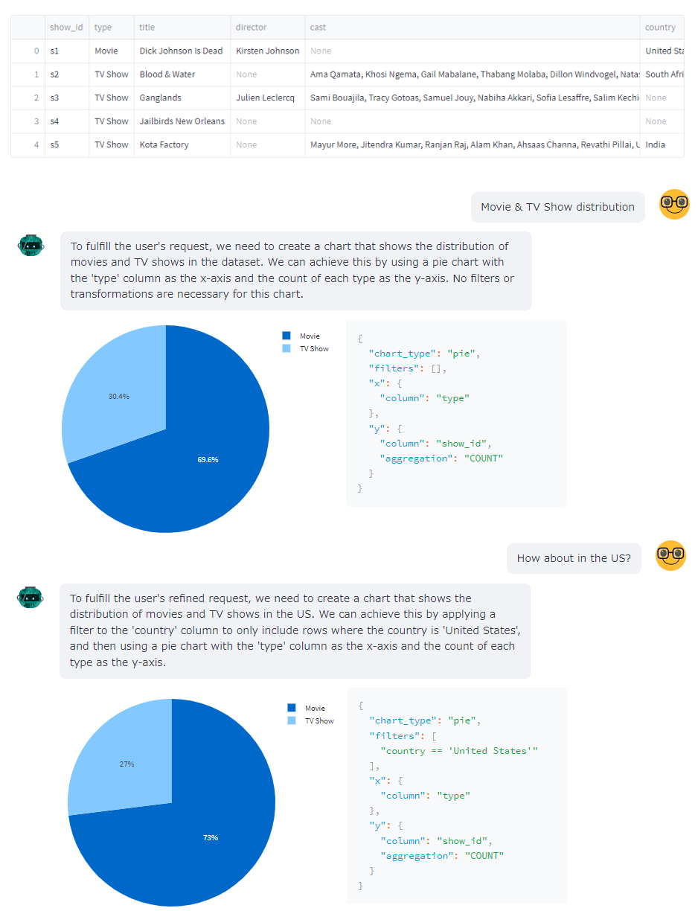

# 📈 Chat2Plot - interactive & safe text-to-visualization with LLM

This library uses LLMs to generate:

1. Visualization 
2. High-level chart specifications in json (You can choose between a simple or vega-lite format)
3. Explanation

from natural language requests for given data.

Chat2Plot does not generate executable code or SQL from the LLM, 
so you can safely generate visualizations.

demo: https://chat2plot-sample.streamlit.app/



## Quick Start

```shell
pip install chat2plot
```

```Python
import os
import pandas as pd
from chat2plot import chat2plot

# 1. Set api-key
os.environ["OPENAI_API_KEY"] = "..."

df = pd.read_csv(...)

# 2. Pass a dataframe to draw
c2p = chat2plot(df)

# 3. Make a question about the data
result = c2p("average target over countries")
result.figure.show()  # draw a plot
print(result.config)  # get a config (json / dataclass)
print(result.explanation)  # see the explanation generated by LLM

# you can make follow-up request to refine the chart
result = c2p("change to horizontal-bar chart")
result.figure.show()
```

## Why Chat2Plot?

Inside Chat2Plot, LLM does not generate Python code,
but generates plot specifications in json.

The declarative visualization specification in json is transformed into actual charts in 
Chat2Plot using plotly or altair, but users can also use json directly in their own applications.

This design limits the visualization expression compared to Python code generation 
(such as ChatGPT's Code Interpreter Plugin), but has the following practical advantages:

- Secure
    - More secure execution, as LLM does not directly generate code.

- Language-independent
    - Declarative data structures are language-agnostic, making it easy to plot in non-Python environments.

- Interactive
    - Declarative data can be modified by the user to improve plots through collaborative work between the user and LLM.

By default, chat2plot uses [function calling API](https://openai.com/blog/function-calling-and-other-api-updates).

## Examples

### Custom language models
`gpt-3.5-turbo-0613` is used by default, but you can use other language models.

```python
import pandas as pd
from langchain.chat_models import AzureChatOpenAI
from chat2plot import chat2plot

plot = chat2plot(pd.DataFrame(), chat=AzureChatOpenAI())
ret = plot.query("<your query>")
```

### Vega-lite format

```python
import pandas as pd
from chat2plot import chat2plot

plot = chat2plot(pd.DataFrame(), schema_definition="vega")
ret = plot.query("<your query>")

assert isinstance(ret.config, dict)  # vega-lite format
print(ret.config)
```

### Custom chart definition

```python
import pydantic
import pandas as pd
from chat2plot import chat2plot

class CustomChartConfig(pydantic.BaseModel):
    chart_type: str
    x_axis_name: str
    y_axis_name: str
    y_axis_aggregate: str

plot = chat2plot(pd.DataFrame(), schema_definition=CustomChartConfig)
ret = plot.query("<your query>")

# chat2plot treats the data type you pass as a chart setting
assert isinstance(ret.config, CustomChartConfig)
```

### Specifying output language
You can specify in which language the chart explanations should be output. 
If not specified, it will return as much as possible in the same language as the user's question, 
but this option is often useful if you always want output in a specific language.

```python
import pandas as pd
from chat2plot import chat2plot

plot = chat2plot(pd.DataFrame(), language="Chinese")
ret = plot.query("<your query>")

print(ret.explanation)  # explanation 
```

### Privacy preserving
When `description_strategy="dtypes"` is specified, chat2plot will not send the data 
content (but just column names) to LLM.

```python
import pandas as pd
from langchain.chat_models import AzureChatOpenAI
from chat2plot import chat2plot

plot = chat2plot(pd.DataFrame(), description_strategy="dtypes")
ret = plot.query("<your query>")
```


## API

A `Chat2Plot` instance can be created using the `chat2plot` function.

```Python
def chat2plot(
    df: pd.DataFrame,
    schema_definition: Literal["simple", "vega"] | Type[pydantic.BaseModel] = "simple",
    chat: BaseChatModel | None = None,
    function_call: bool | Literal["auto"] = "auto",
    language: str | None = None,
    description_strategy: str = "head",
    custom_deserializer: ModelDeserializer | None = None,
    verbose: bool = False,
) -> Chat2PlotBase:
```

- **df** - Data source for visualization.
- **schema_definition** (optional) - Type of json format.
  - `vega` - A vega-lite compliant format
  - `simple` - chat2plot's built-in format, parsed as `chat2plot.PlotConfig`

  If you want chat2plot to generate chart definitions according to your own defined schema, 
  you can pass any type that extends pydantic.BaseModel instead of these two options.
- **chat** (optional) - The chat instance for interaction with LLMs.
  If omitted, `ChatOpenAI(temperature=0, model_name="gpt-3.5-turbo-0613")` will be used.
- **function_call** (optional) - Specifies whether to use the [function calling API](https://openai.com/blog/function-calling-and-other-api-updates).
  If omitted, it is automatically determined based on the underlying model type. 
- **language** (optional) - Language of explanations. If not specified, it will be automatically inferred from user prompts.
- **description_strategy** (optional) - Type of how the information in the dataset is embedded in the prompt.
  - `head` - send `df.head(5)` to LLMs.
  - `dtypes` - send `df.dtypes` to LLMs. This can be used when you do not want to send contents of `df` to LLMs.
- **custom_deserializer** (optional) - Specifies a custom deserializer to convert json returned from the LLM into a chart configuration.
- **verbose** (optional) - If `True`, chat2plot will output logs.


Once an instance is created, a graph generation request can be made 
by calling `query` method, or simply passing the same arguments to the instance (`__call__`).

```Python
def query(self, q: str, config_only: bool = False, show_plot: bool = False) -> Plot:
```
- **q** - A query string.
- **config_only** - If `True`, skip generating figure.
- **show_plot** - If `True`, showing the generated figure is also performed inside chat2plot.

The default behavior is `config_only=False` and `show_plot=False`, 
i.e. Chat2Plot generates a figure as well as configuration, but does not draw it.

The `query` method returns `Plot` object, and this has the following properties:

```Python
@dataclass(frozen=True)
class Plot:
    figure: alt.Chart | Figure | None
    config: PlotConfig | dict[str, Any] | None
    response_type: ResponseType
    explanation: str
    conversation_history: list[langchain.schema.BaseMessage] | None
```

- **figure** - The generated figure (chart).
- **config** - The chart specification. Returns dict for `vega` mode and `PlotConfig` for `simple` mode.
- **response_type** - The result code of the response.
- **explanation** - Reason for the chart setup, generated by LLMs.
- **conversation_history** - Full history of conversation (including retry prompt).
